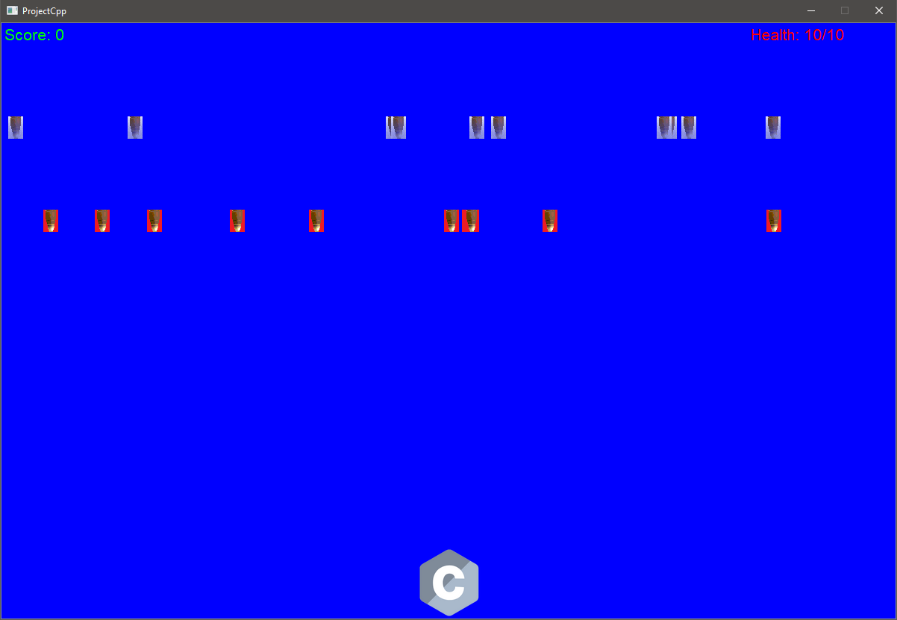

# ProjectCpp

## How to build

 1) download QT [here](https://www.qt.io/download-qt-installer)  
 2) download my project by clicking on the green button on the right and press "download ZIP" 
 3) open the qt file you just downloaded , login and press next.  
 4) here, check the 2 checkboxes and press next 2x  
 5) choose out of the 2 options and press next  
 6) pick ur install location and check custom installation, press next  
 7) open the dropdown of the latest qt version and check mingw and press next.  
 8) read the agreement and press next 2 times  
 9) press install and open qt creator  
 10) once qt creator is opened, press on "open" and pick the qt project file (.pro) from the downloaded files directory.  
 11) once the project is loaded, press on the play button on the left bottom.  
 12) congrats, you just build the project!  
